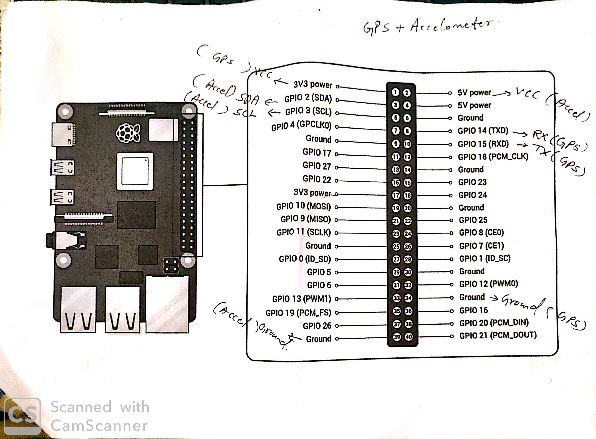
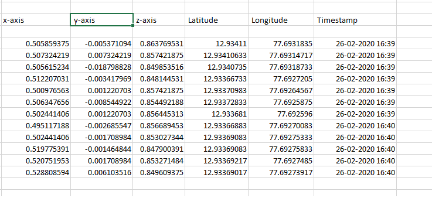

we have merged the 2 files code of sensor

1. Aprroach 1 of gps with accelerometer

we have the schematic in the form of written sheet:

2. However, a simpler option could be to output the date to a CSV (Comma Seperated Value) file that could be used by various programs later on. Then we have created a csv file (sensor_reading.csv) for the code to check the data printed by the program and also made sure that it is edited for manual entry of columns in the file. logging data from Raspberry Pi using Python and Excel which collect data and save the output of the collection or analysis.

I have commented the parts of the program that may need commenting such as the import of the csv module (to open, write or amend csv files) and that I’m using the “a” option to amend the csv rather than the “r” to read it or the “w” to write it. I did originally use the “w” option but that overwrites any data in the csv file which is not great if you are trying to keep a log.

In my csv file I’ve manually added a title row which says:

x-axis	 y-axis	 z-axis	 Latitude	 Longitude	 Timestamp

Your file that located in your /home/pi/safe-ride/source/Method 1/ or any location you prefer is a comma-separated value(CVS) file. Comma-separated values (CVS) file is a formatted file that stores tabular data (numbers and text) which separated by comma. To open and modify this file, simply double click on it, or open it with Microsoft Excel. You can plot your data with Chart tools that available in Microsoft Excel.

I’ve then created a function (file.write) that inserts the readings in the same order. I’m using cron to run the Python program every second and this captures the readings to a csv file.

it will look something like this opened in excel sheet:

